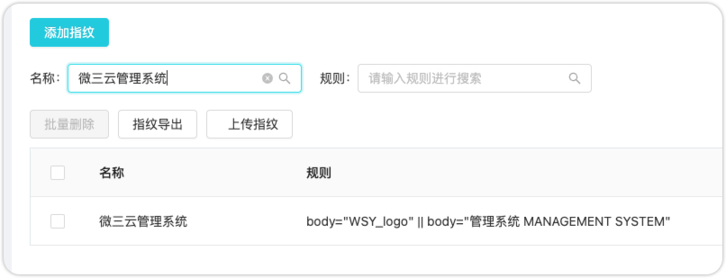

# ARL-Finger-ADD-Plus

## 主要功能

批量添加指纹`ARL(最新版)`

## 已支持导入的指纹库列表

1. [Ehole3.1](https://github.com/EdgeSecurityTeam/EHole/releases/tag/v3.1)自带的指纹文件

2. [Finger](https://github.com/EASY233/Finger/blob/main/library/finger.json)指纹

## 用法:

```
提示：本工具只适配项目源码下的Finger指纹，网上下载的Finger指纹可能不适配，如需使用网上下载的Finger指纹，需要自行修改代码。

usage:

ARL API Key 用法：
python3 ARL-Finger-ADD.py -u http://192.168.1.1:8888 -t 1234567890abcdefg -p ./finger.json

ARL 用户名密码 用法：
python3 ARL-Finger-ADD.py -u http://192.168.1.1:8888 -a admin:arlpass -p ./finger.json
```
> 提示：认证方式使用`-a`或者`-t`都可以，以下示例使用`-t`进行。

### 导入[Ehole3.1](https://github.com/EdgeSecurityTeam/EHole/releases/tag/v3.1)自带的指纹文件

```python
python3 ARL-Finger-ADD.py -u http://192.168.1.1:8888 -t 1234567890abcdefg -p ./finger.json
```

### 导入[Finger](https://github.com/EASY233/Finger/blob/main/library/finger.json)指纹

```python
python3 ARL-Finger-ADD.py -u http://192.168.1.1:8888 -t 1234567890abcdefg -p ./Finger_finger.json
```

## 版本记录

### v1.0.0 2023-11-23

> 提示：此版本基于Github上[ARL-Finger-ADD](https://github.com/loecho-sec/ARL-Finger-ADD)的代码修改而来，感谢原作者

1. 修复Bug：资产有多个指纹规则的，添加为多个指纹规则，而不是一个指纹规则

> 比如："keyword": ["WSY_logo","管理系统 MANAGEMENT SYSTEM"]
>
> 源代码添加的规则是：body="WSY_logo"，优化后添加的规则是：body="WSY_logo" || body="管理系统 MANAGEMENT SYSTEM"，下文截图有体现

2. 修复Bug：源代码添加源指纹库时，不添加header规则，优化后添加header规则，如：header="ecology_JSessionid"

3. 优化认证方式，支持ARL原生的ARL API KEY认证模式，也支持ARL的用户名密码认证模式，两个参数都配置，优先使用ARL API KEY认证模式

>  ARL API KEY配置教程：https://tophanttechnology.github.io/ARL-doc/api/

4. 更换默认finger.json文件，使用[Ehole3.1](https://github.com/EdgeSecurityTeam/EHole/releases/tag/v3.1)自带的指纹库，3.0指纹库只有683个，3.1增加到998个

5. 修改了指纹上传接口，使用ARL的upload接口，因为upload接口支持去重（去重规则暂未了解）

6. 优化代码逻辑（大家无需关心）

### v1.1.0 2023-11-26

1. 支持导入[Finger](https://github.com/EASY233/Finger/blob/main/library/finger.json)指纹，已完成

## TODO

计划增加以下指纹库支持：

- [x] [Finger](https://github.com/EASY233/Finger/blob/main/library/finger.json) 截止2023年3月11日最新版，Finger有1007个
- [ ] [dismap](https://github.com/zhzyker/dismap/blob/main/readme-zh.md#-rulelab) 截止2023年11月23日最新版，Finger有4598个
- [ ] [FingerprintHub](https://github.com/0x727/FingerprintHub/blob/main/web_fingerprint_v3.json) 截止2023年11月23日最新版，Finger有2839个(name想通的要做规则合并)

## 添加后的效果

**指纹规则支持逻辑或`||`，如下图所示**




## 版权声明

ARL-Finger-ADD-Plus本软件，通过BigYoung购买专栏后，有权进行个人使用，禁止公开发布和用于商业用途，否则BigYoung有权追究法律责任。

## 免责声明

ARL-Finger-ADD-Plus 仅供学习交流使用，禁止用于非法用途，否则后果自负。

## 下载地址&获取最新版

https://note.mowen.cn/note-intro/?noteUuid=JnbQB364GpUSxVYGoT5wt

